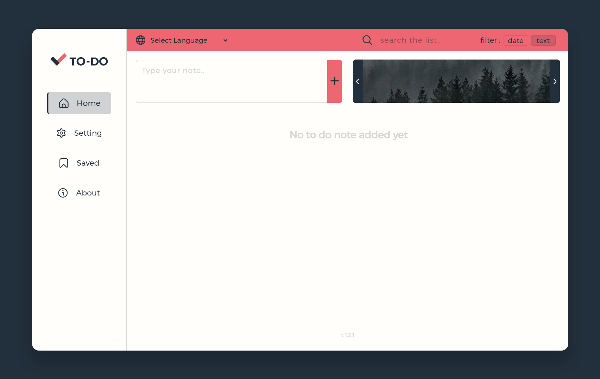

# To Do WebApp

  -Full responsive to-do web application  
  -No back-end used on this project and everything happens on front-end 
  -This project written with vanila.js, css and html

# Options
  -add note 
  -control notes with delete, edit, save and check buttons 
  -change app language  
  -search throw the notes 
  -image slider on desktop veiw 
  -customize app with changing theme and font size 
  -delete all saved data 
  -control saved notes 
  
# Project Link
  https://to-do-web-app-eta.vercel.app/
  
i try to work on this project everyday to fix its bugs and update it for you to enjoy :)
## Project Status
Updating
